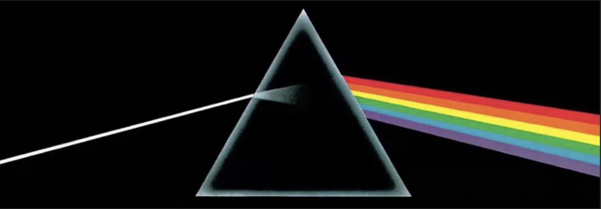

<p align="center" width="80%">

</p>

# NativeRes-LLaVA
Official code repo for our work [**Native Visual Understanding: Resolving Resolution Dilemmas in Vision-Language Models**](https://github.com/Niujunbo2002/NativeRes-LLaVA#)!

<p align="center">
  <a href="https://arxiv.org/abs/2501.05510" style="margin-right: 10px;"> 
    
  </a>
  <a href="https://huggingface.co/collections/Niujunbo2002/nativeres-llava-682d6f2f94ed89a9b2b71cb1" style="margin-right: 10px;"> 
    
  </a>
</p>


## 📰 News
- [2025/1/6] 🔥🔥🔥 We released the paper on [arXiv](https://github.com/Niujunbo2002/NativeRes-LLaVA#)!

## 📌 ToDo Lists
- [x] Release Inference Code
- [x] Release NativeRes-LLaVA 1B && 2B && 7B Checkpoints
- [x] Release NativeRes-ViT (qwen2-vl-665m-patch14-native)
- [ ] Release Training Code (The code is being organized.)
- [ ] Release RC-Bench (The code is being organized.)
- [ ] Support SigLIP 2 with native resolution
- [ ] Support RL for post-train
- [ ] Support Multimodal Reasoning like O3

## Install

This is a repo enabling you train a LLaVA using images with native resolution.

1. Clone this repository and navigate to LLaVA folder

```bash
git clone https://github.com/Niujunbo2002/NativeRes-LLaVA.git
cd NativeRes-LLaVA
```

2. Install Package

```Shell
conda create -n nativeres python=3.10 -y
conda activate nativeres
pip install --upgrade pip  # enable PEP 660 support
pip install torch==2.6.0
pip install torchaudio==2.6.0
pip install torchvision==0.21.0
pip install -r requirements.txt
pip install transformers==4.50.3
```

Install the required environment in `requirements.txt`. The Transforms version should be able to support at least `Qwen2-VL model`.

## Quick Start

First, download the checkpoints from the following folder: [**NativeRes-LLaVA**](https://huggingface.co/collections/Niujunbo2002/nativeres-llava-682d6f2f94ed89a9b2b71cb1#)

We have released **NativeRes-ViT** (*qwen2-vl-665m-patch14-nativeres*), a ViT model capable of handling native-resolution inputs.

We have also released the model **NativeRes-LLaVA-qwen2-7b-qwen2vl**, which integrates **NativeRes-ViT** and uses **Qwen2-7b-Instruct** as the language model. You are free to configure the `min_image_tokens` and `max_image_tokens` parameters (default: `min_image_tokens=4`, `max_image_tokens=4096`).

You need to first download **NativeRes-ViT** (`Niujunbo2002/qwen2-vl-665m-patch14-nativeres`) to your local machine.
Then, update the `"mm_vision_tower"` path in `Niujunbo2002/NativeRes-LLaVA-qwen2-7b-qwen2vl/config.json` to point to the **local path** of NativeRes-ViT.


```
{
  "add_faster_video": false,
  "add_time_instruction": false,
  "architectures": [
    "LlavaQwenForCausalLM"
  ],
  ...
  "mm_vision_select_feature": "patch",
  "mm_vision_select_layer": -1,
  "mm_vision_tower": "/Local_Path/NativeRes/qwen2vl-665m-patch14-native",
  "mm_vision_tower_lr": 2e-06,
  ...
}

```


### Inference

For Inference, we have a simple example, just run:

```
python ./infer_demo.py
```

## Train
Please note that the following is merely our reference to the official LLaVA training strategy. You are free to choose any training strategy you believe to be correct and efficient based on our codebase.

### Stage1: Pretrain

If you want to run using siglip ViT, which not support NativeRes, you can run:

```
bash scripts/train/pretrain_siglip.sh
```

Otherwise you can run in NativeRes mode which utilize Qwen2-VL ViT to support any resolution:

```
bash scripts/train/pretrain_qwenvit.sh
```

### Stage2: Finetune

For finetuning using siglip, just run

```
bash scripts/train/direct_finetune_siglip_a4_v1.5.sh
```

Otherwise you can run in NativeRes mode by:(using the LLaVA1.5 Fintuning Dataset now, you can change it anyway.)

```
bash scripts/train/direct_finetune_qwen_a4_v1.5_4_2048.sh
```

### Notes

1. Still not support zero3 in NativeRes mode now.
2. Update `sys.path.append("/mnt/petrelfs/niujunbo/zhengyuanhong/NativeResLLaVA")` to your personal path.
3. Still not support `video` now.


## Contact
Junbo Niu: 21376334@buaa.edu.cn


## Acknowledgements
This codebase is built upon [LLaVA](https://github.com/haotian-liu/LLaVA) and leverages several open-source libraries. We extend our gratitude to the contributors and maintainers of these projects.


## Citation
If you find our work helpful for your research, please consider giving a star ⭐ and citation 📝.
```bibtex

```